# 📉 Analyzing Customer Churn

## Problem Statement

Customer churn poses a significant challenge for subscription-based businesses, as it directly affects both revenue and long-term growth. Databel, a fictitious telecom company, has recently experienced an increase in customer churn.  
The objective of this project is to use **Excel** to analyze customer churn data, identify key drivers, and uncover actionable insights that could help reduce churn in the future.

# 📒 Report of Analyzing Customer Churn

## Objectives

1. **Identify the main reasons for customer churn** and determine which features are most strongly associated with it.
2. **Examine churn rates across different age categories** to detect patterns or at-risk groups.
3. **Analyze Unlimited Data Plan customers** by segmenting their historical data usage into:
   - Less than 5 GB  
   - Between 5 GB and 10 GB  
   - More than 10 GB  
4. **Explore churn patterns across U.S. states** and assess the impact of:
   - International Plan ownership  
   - Customer tenure  
   - Payment type (Month-to-Month, One Year, Two Years)  

## Data Sources

The dataset was obtained from the **DataCamp Case Study: Analyzing Customer Churn**.

- **Customer Table** – contains information for each individual customer.
- **Aggregate Table** – contains counts of customers by plan combinations and other service options.

## Data Loading

Two tables, `Customer` and `Aggregate`, were imported into Excel using **Power Query**.

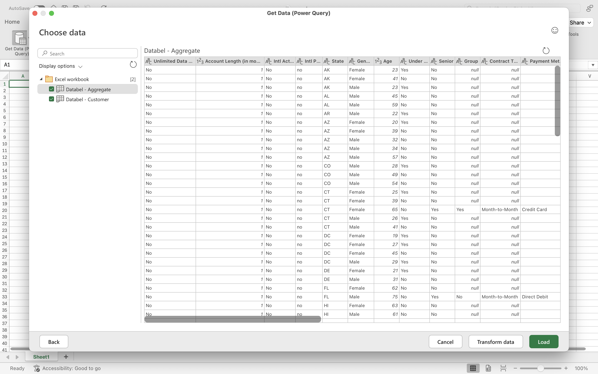  
*Import of Aggregate table into Power Query.*

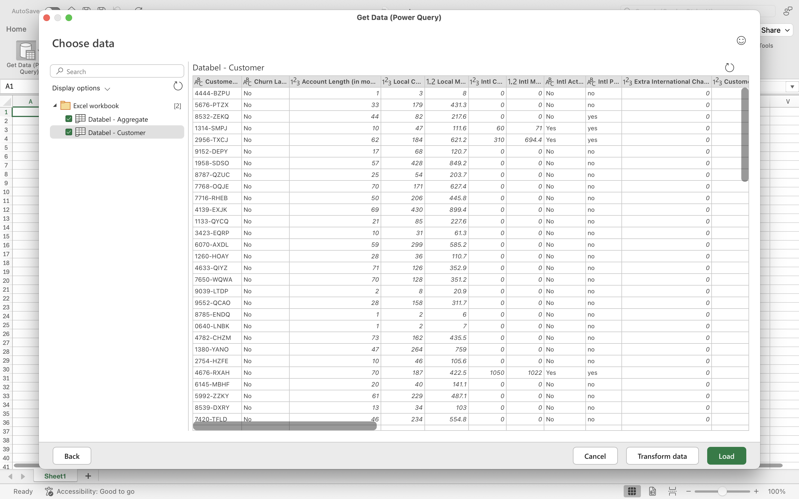  
*Import of Customer table into Power Query.*

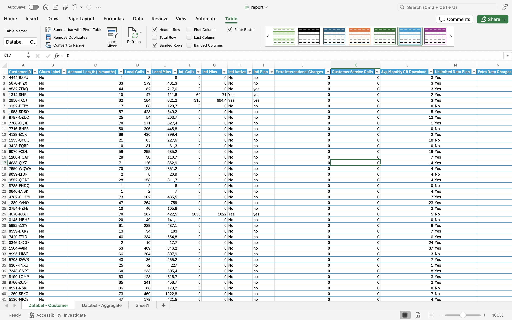  
*Customer table loaded into Excel.*

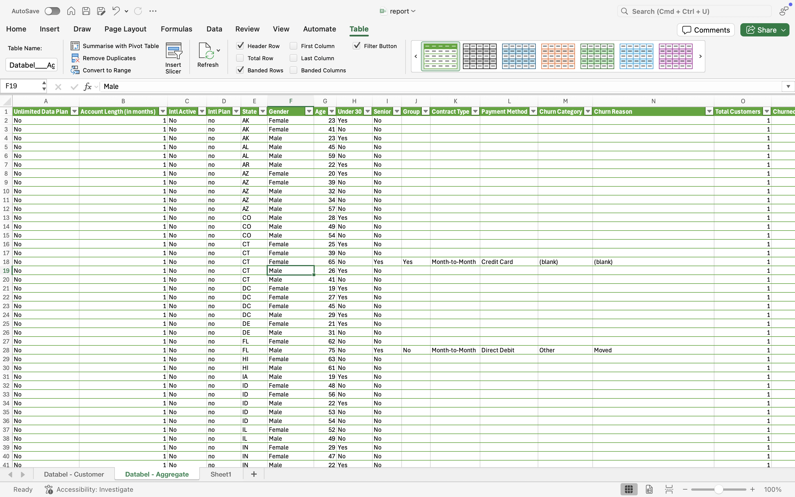  
*Aggregate table loaded into Excel.*

## Data Cleaning

- Checked for duplicate records in the `Customer ID` column using **Data → Remove Duplicates**.  

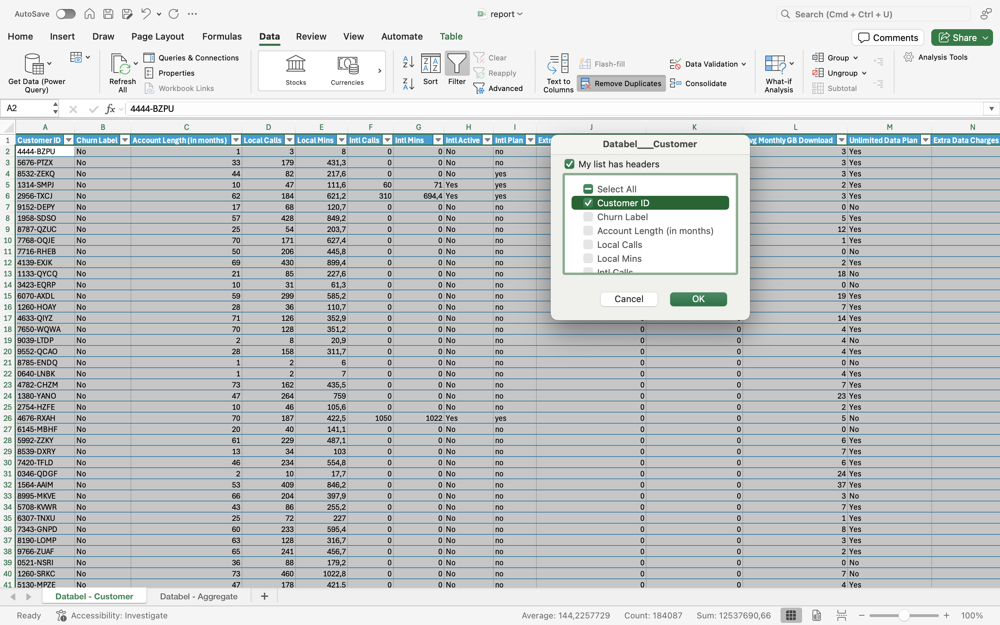  
*Removing duplicates from Customer ID column.*

No duplicates were found.  

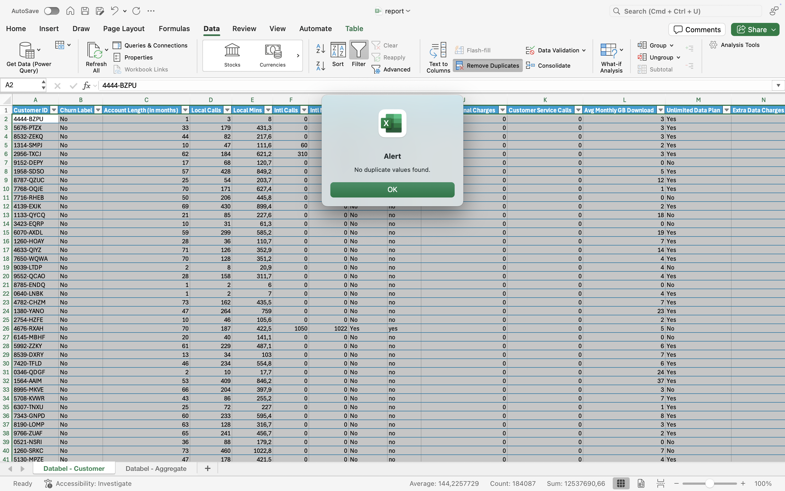  
*Excel confirmation that no duplicates exist.*

## Descriptive Statistics

- Total number of customers: *6687*
- Churn rate: *26.86%*  

These metrics served as the baseline for further analysis.

## Data Exploration & Insights

### 1. Main Reasons for Churn
- Nearly **50% of customer departures** are due to competitive offers — mainly **better device options and more favorable plan conditions** provided by competitors.
- Competition-related churn remains the most significant driver of customer loss.

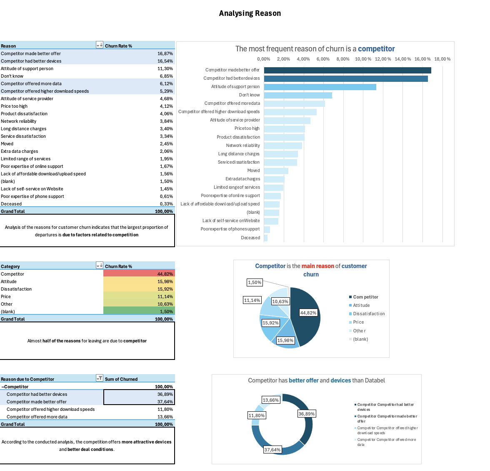  
*Breakdown of customer churn reasons.*

### 2. Churn by Age Group
- The **highest churn rate** occurs among customers aged **30–65 years**.
- Within this group, churn is relatively evenly distributed, indicating no strong age sub-clusters.

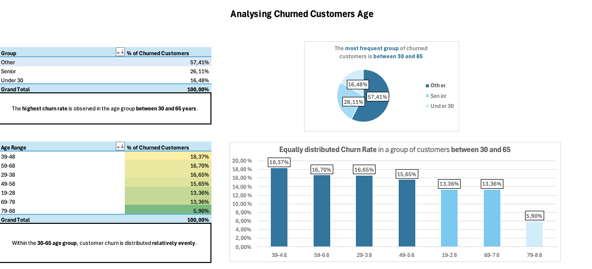  
*Churn analysis segmented by customer age group.*

### 3. Unlimited Data Plan – Data Usage Segmentation
- Customers with **average data usage** (5–10 GB) under the Unlimited Plan churn more frequently than low (<5 GB) or high (>10 GB) usage customers.
- This suggests possible dissatisfaction with perceived value in the mid-usage segment.

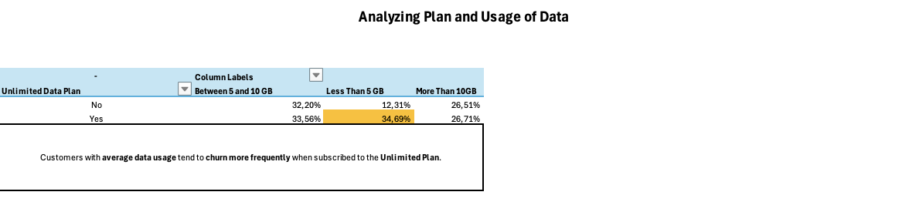  
*Churn rates for Unlimited Plan customers by data usage level.*

### 4. Churn by Geography, International Plan, and Payment Type
- International Plan subscribers churn **significantly more often** than others in certain states — particularly **CA, IN, NH, KY, and LA** — which show the largest churn rate differences.
- **Payment Type Impact:**
  - **Month-to-Month plans** have the highest churn rates, especially within the **first four years of service**.
  - **One- and Two-Year contracts** show **no significant churn spikes**, indicating higher retention for long-term commitments.

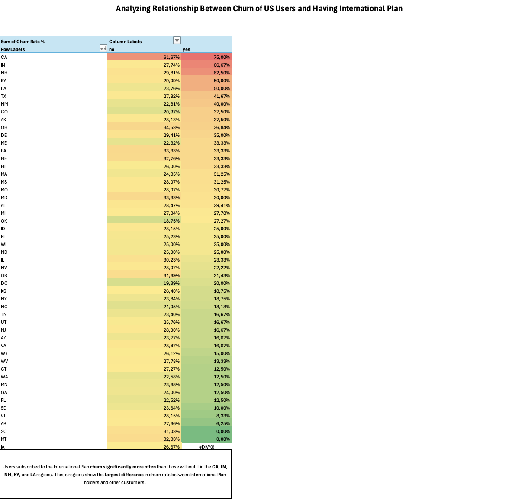  
*Churn analysis based on International Plan ownership and state distribution.*

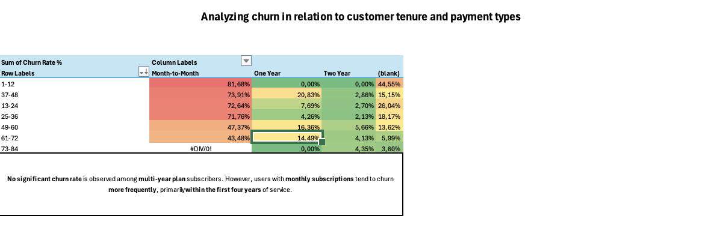  
*Comparison of churn rates across different subscription types.*

# Conclusion

This analysis highlights competition as the primary driver of churn, with notable secondary factors including customer age group, specific data usage patterns, and certain geographic/plan combinations.  
Addressing competitive disadvantages, targeting mid-usage Unlimited Plan customers, and incentivizing longer-term contracts may help Databel reduce future churn.

---
*Tools Used: Excel, Power Query, Pivot Tables, Conditional Formatting.*
